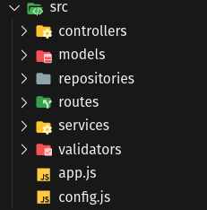

# Wall-App API

To run this project make sure you have nvm or NodeJS and run following commands:

    npm install
    npm start

This is a REST API created with <strong>NodeJS</strong> and <strong>ExpressJS</strong> to serve my Wall App.

## Design pattern

Used a Repository Pattern structure (MVCS) as it follows:

## Dependencies

Used some dependencies like:

- [sendgrid](https://sendgrid.com/)
- [axios](https://github.com/axios/axios)
- [jsonwebtoken](https://github.com/auth0/node-jsonwebtoken)

## Tests

To run test:

      npm start
      npm test

Tests were coded with [Jest](https://jestjs.io/)

## Data Base
Used MongoDB with [mongoose](https://mongoosejs.com/) engine

Hosted for free at [MongoDB Atlas Cloud](https://cloud.mongodb.com/)

## Deployment

Hosted for free at [Heroku](https://www.heroku.com/) on https://wall-app-api-br.herokuapp.com/
